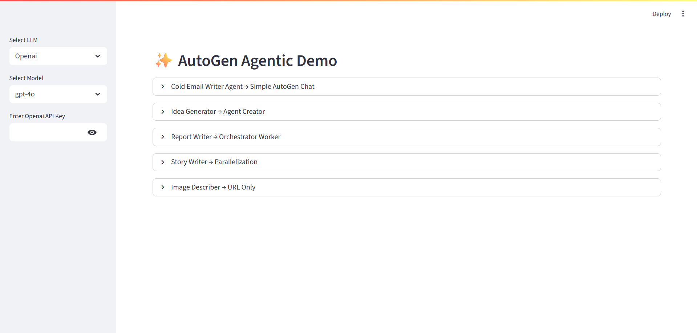
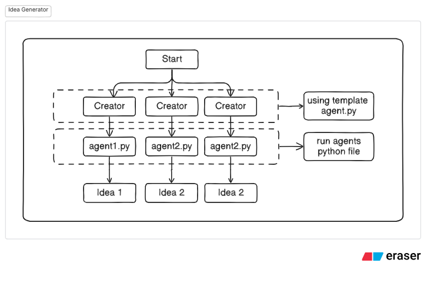
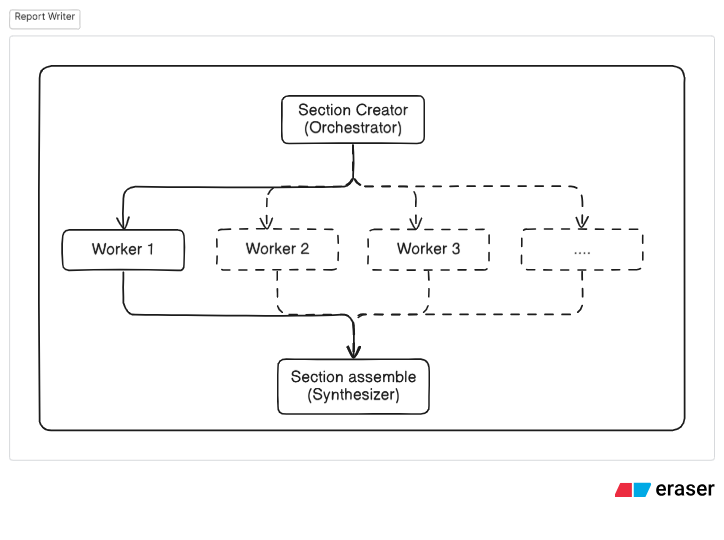
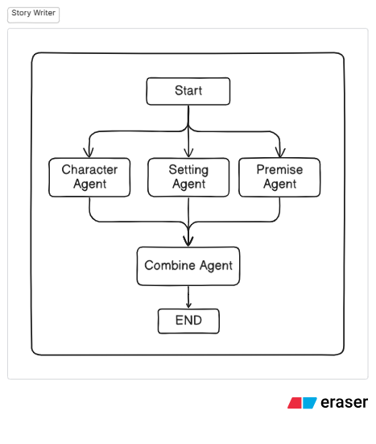

# ✨ AutoGen Agentic Demo

A Streamlit app showcasing practical **agentic patterns** with [AutoGen](https://github.com/microsoft/autogen) — including multi-agent orchestration over gRPC, lightweight single-runtime parallelization, structured multimodal outputs, and a tiny chat-style tool.

<p align="center">
  
</p>

> **What you get**
>
> - **Cold Email Writer** – one-box brief → short first-touch email
> - **Idea Generator** – 5 creators in parallel over gRPC
> - **Report Writer** – plan sections + write in parallel (orchestrator/worker)
> - **Story Writer** – 3 parallel subagents + 1 combine step
> - **Image Describer** – URL → structured, Pydantic-validated description

---

## 📸 Screenshots / Diagrams

| Home                         | Idea Generator                                   | Report Writer                                  | Story Writer                                 |
| ---------------------------- | ------------------------------------------------ | ---------------------------------------------- | -------------------------------------------- |
|  |  |  |  |

> Place images under `assets/` (filenames above).
> In this repo’s working container they live at:
> `/mnt/data/home.png`, `/mnt/data/idea-generator.png`, `/mnt/data/report-writer.png`, `/mnt/data/story-writer.png`.

---

## 🧩 Features

- **Plug-and-play LLMs (auto-init)**
  Select **OpenAI / Groq / Gemini**, pick a model, paste API key — the client initializes automatically on start and when inputs change.

- **gRPC multi-agent workflows**

  - **Idea Generator**: fires 5 `Creator` agents concurrently via `GrpcWorkerAgentRuntimeHost/Runtime`.
  - **Report Writer**: `Creator` plans sections → `ContentAgent` writes each section **in parallel** → deterministic assembly.

- **Single runtime parallelization**
  **Story Writer** uses `SingleThreadedAgentRuntime`: Characters, Setting, Premise run concurrently; a Combine agent synthesizes an intro.

- **Multimodal structured outputs**
  **Image Describer** (URL only) returns a validated `ImageDescription { scene, message, style, orientation }` using `output_content_type`.

- **Tiny chat tool**
  **Cold Email Writer**: one text brief → concise, plain-text cold email (subject + 80–120 words + single CTA).

- **Good UX defaults**
  Streamlit expanders, tabs, downloads; stable widget `key`s; safe shutdowns; simple error surfaces.

---

## 🏗️ Architecture (high level)

- **UI**: Streamlit
- **Agents**: `autogen_agentchat` + `autogen_core` (+ `autogen_ext` for gRPC runtime)
- **LLMs**: thin wrappers: `OpenaiLLM`, `GroqLLM`, `GeminiLLM` (constructor requires API keys)
- **Runtimes**:

  - `GrpcWorkerAgentRuntimeHost` / `GrpcWorkerAgentRuntime` (Idea/Report)
  - `SingleThreadedAgentRuntime` (Story)

---

## ⚙️ Getting Started

### 1) Prerequisites

- Python **3.10+**
- A modern browser
- API keys for at least one provider (OpenAI / Groq / Gemini)

### 2) Install

```bash
# clone repo
git clone <your-repo-url>
cd <your-repo>

# create & activate venv (recommended)
python -m venv .venv
# Windows
.venv\Scripts\activate
# macOS/Linux
source .venv/bin/activate

# install
pip install -r requirements.txt
```

### 3) Run

```bash
streamlit run app.py
```

Open the local URL Streamlit prints.
Use the **left sidebar** to pick Provider + Model and paste your **API key** — the client auto-initializes.

---

## 🧪 Modules & Usage

### Cold Email Writer — Simple AutoGen Chat

- **Input**: one text brief (who, offer, context)
- **Output**: plain-text email with `Subject:` + \~80–120 words + single CTA
- Backed by an `AssistantAgent` with a tight system prompt.

### Idea Generator — Agent Creator (gRPC)

- **Input**: comma-separated sectors (e.g., `HealthCare, Education`)
- **Flow**: registers `Creator` → spins **5** parallel `send_message` calls → gathers in order → tabs + download.
- **Port**: defaults to `localhost:50051`.

### Report Writer — Orchestrator Worker (gRPC)

- **Flow**: `Creator` plans sections → `ContentAgent` writes each section **concurrently** (order preserved via `asyncio.gather`) → assembled with `---` separators.
- **Output**: markdown report + download.

### Story Writer — Parallelization (Single Runtime)

- **Flow**: Characters / Setting / Premise in parallel → Combine synthesizes the intro.
- **Runtime**: `SingleThreadedAgentRuntime` (no gRPC).

### Image Describer — URL Only (Multimodal + Structured)

- **Input**: image URL (optional free-text prompt)
- **Output**: `ImageDescription` (Pydantic) with `scene`, `message`, `style`, `orientation`.
- Uses `output_content_type=ImageDescription` and coerces dict/JSON if needed.

---

## 🔐 Security Notes

- API keys are **required in constructors**; the UI **does not store** your raw keys in persistent state or files.
- The app uses a **hash signature** internally to avoid needless re-initialization; only a boolean “key set” flag is kept.

---

## 🧰 Troubleshooting

- **gRPC port already in use (50051)**
  Stop other workers or change the port in the orchestrators.

- **`StreamlitDuplicateElementId`**
  Ensure every button/input has a unique `key` (this repo already does).

- **`Unknown type ... with content type application/json`**
  If returning custom Pydantic models over gRPC, either:

  - return plain JSON-serializable dicts; or
  - register a serializer with AutoGen’s `SerializationRegistry`.

- **Multimodal model**
  Use a vision-capable model (e.g., `gpt-4o-mini`) for Image Describer.

---

## 🗺️ Roadmap

- Add RAG agent example
- Multi-turn tool-use flows
- Persist/restore sessions
- Dockerfile & deploy examples

---

## 📝 License

MIT (or update to your preferred license).

---

## 🙌 Acknowledgements

- [AutoGen](https://github.com/microsoft/autogen) team & community
- Streamlit
- Diagrams made with **Eraser** (see screenshots)

---

### Quick Links

- **Run**: `streamlit run app.py`
- **Assets**: put screenshots in `assets/` with filenames shown above
- **Where to start**: `app.py` and `src/components/agents/*/orchestrator.py`
